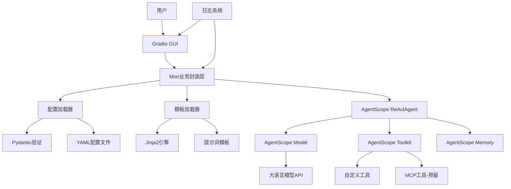

# Mori - 虚拟AI女友Agent项目架构设计

## 项目概述

Mori是一个基于AgentScope框架的虚拟AI女友agent系统。本项目充分利用AgentScope已有的功能（Model、Agent、Tool、Memory等），专注于业务逻辑和用户体验的实现。

## 技术栈

- **核心框架**: AgentScope 1.0.8+ (提供Model、Agent、Tool、Memory等核心功能)
- **模板引擎**: Jinja2 3.1.0+ (用于自定义提示词模板)
- **配置管理**: PyYAML + Pydantic 2.0+ (配置文件验证)
- **GUI框架**: Gradio 4.0.0+ (Web界面)
- **依赖管理**: uv
- **代码规范**: pre-commit + black + ruff
- **Python版本**: 3.10+

## AgentScope已提供的功能

根据官方文档，AgentScope已经提供了以下完整功能，我们将直接使用：

### 1. Model层
- ✅ 多种模型API支持（OpenAI、DashScope、Anthropic、Gemini、Ollama等）
- ✅ 流式输出支持
- ✅ 工具调用API
- ✅ 推理模式支持
- ✅ 统一的ChatResponse接口

### 2. Agent层
- ✅ ReActAgent（支持工具调用、并行执行、结构化输出）
- ✅ 实时中断机制
- ✅ Agent Hooks系统
- ✅ 自定义Agent基类（AgentBase、ReActAgentBase）

### 3. Tool层
- ✅ Toolkit工具管理器
- ✅ 自动从Python函数解析工具JSON Schema
- ✅ 同步/异步工具函数支持
- ✅ 流式工具响应
- ✅ 工具执行中断
- ✅ 动态扩展JSON Schema
- ✅ 内置工具函数（代码执行、Shell命令、文件操作等）

### 4. Memory层
- ✅ InMemoryMemory（短期记忆）
- ✅ 长期记忆支持
- ✅ 自动状态管理

### 5. 其他功能
- ✅ MCP协议支持
- ✅ Prompt Formatter
- ✅ Pipeline工作流
- ✅ Tracing追踪
- ✅ Evaluation评估

## 我们需要实现的部分

基于AgentScope已有功能，我们只需要实现：

1. **业务层封装** - Mori核心类，封装AgentScope的使用
2. **配置管理** - 使用Pydantic验证YAML配置
3. **提示词模板** - 使用Jinja2定制Mori的性格和行为
4. **自定义工具** - 实现特定业务工具（如果需要）
5. **GUI界面** - 使用Gradio创建用户界面
6. **日志系统** - 统一的日志管理
7. **项目结构** - 组织代码和配置文件

## 简化后的系统架构



## 目录结构

```
mori/
├── mori/                          # 核心模块
│   ├── __init__.py
│   ├── mori.py                    # Mori业务封装类
│   ├── config.py                  # 配置加载和Pydantic验证
│   │
│   ├── template/                  # 模板系统
│   │   ├── __init__.py
│   │   ├── loader.py              # Jinja2模板加载器
│   │   └── internal_template/     # 内置模板
│   │       ├── __init__.py
│   │       └── mori.jinja2        # Mori提示词模板
│   │
│   ├── agent/                     # Agent相关（轻量封装）
│   │   ├── __init__.py
│   │   └── factory.py             # Agent工厂函数
│   │
│   ├── tool/                      # 自定义工具
│   │   ├── __init__.py
│   │   └── internal_tools/        # 内置工具
│   │       ├── __init__.py
│   │       └── example_tools.py   # 示例工具
│   │
│   ├── utils/                     # 工具函数
│   │   ├── __init__.py
│   │   └── helpers.py
│   │
│   └── mcp/                       # MCP集成（预留）
│       ├── __init__.py
│       └── README.md
│
├── gui/                           # GUI界面
│   ├── __init__.py
│   └── app.py                     # Gradio应用
│
├── logger/                        # 日志系统
│   ├── __init__.py
│   └── config.py                  # 日志配置
│
├── config/                        # 配置文件
│   ├── models.yaml.example        # 模型配置示例
│   ├── agents.yaml.example        # Agent配置示例
│   ├── config.yaml.example        # 全局配置示例
│   └── mcp.json.example           # MCP配置示例
│
├── tests/                         # 测试
│   ├── __init__.py
│   ├── test_config.py
│   ├── test_template.py
│   └── test_mori.py
│
├── .pre-commit-config.yaml        # pre-commit配置
├── pyproject.toml                 # 项目配置
├── README.md                      # 项目说明
├── ARCHITECTURE.md                # 架构文档
└── .gitignore
```

## 核心模块设计

### 1. 配置系统 (mori/config.py)

使用Pydantic验证配置，直接对接AgentScope的模型配置格式：

```python
from pydantic import BaseModel, Field
from typing import Optional, Dict, Any

class ModelConfig(BaseModel):
    """模型配置 - 对应AgentScope的模型配置格式"""
    model_name: str
    model_type: str  # openai, dashscope, ollama等
    api_key: Optional[str] = None
    base_url: Optional[str] = None
    generate_kwargs: Optional[Dict[str, Any]] = None

class AgentConfig(BaseModel):
    """Agent配置"""
    name: str
    model: str  # 引用models.yaml中的模型名称
    template: str  # 模板文件路径
    sys_prompt: Optional[str] = None
    memory_config: Optional[Dict[str, Any]] = None
    parallel_tool_calls: bool = False

class GlobalConfig(BaseModel):
    """全局配置"""
    log_level: str = "INFO"
    log_dir: str = "logs"
    server_host: str = "0.0.0.0"
    server_port: int = 7860
```

### 2. 模板系统 (mori/template/)

使用Jinja2加载和渲染提示词模板，支持多目录和运行时信息注入：

**特性**：
- 支持多目录加载（自定义模板 > 内置模板）
- 自动注入运行时信息（当前时间、日期）
- 智能路径解析（简短名称自动查找）
- 对话历史由AgentScope Memory管理，不需要在模板中包含

```python
# loader.py
from jinja2 import ChoiceLoader, Environment, FileSystemLoader

class TemplateLoader:
    """Jinja2模板加载器 - 支持多目录"""

    def __init__(self, custom_template_dir: str = "config/template"):
        # 创建多个加载器，按优先级排序
        loaders = [
            FileSystemLoader(custom_template_dir),  # 自定义模板（优先）
            FileSystemLoader("mori/template/internal_template"),  # 内置模板
        ]

        self.env = Environment(
            loader=ChoiceLoader(loaders),
            autoescape=select_autoescape()
        )

    def render_template(self, template_name: str, context: dict) -> str:
        """加载并渲染模板"""
        # 简短名称自动添加.jinja2扩展名
        if not template_name.endswith(".jinja2"):
            template_name = f"{template_name}.jinja2"

        template = self.env.get_template(template_name)
        return template.render(**context)
```

**运行时信息注入**（在mori.py中）：
```python
from datetime import datetime

context = {
    "current_time": datetime.now().strftime("%H:%M:%S"),
    "current_date": datetime.now().strftime("%Y年%m月%d日 %A"),
}

sys_prompt = self.template_loader.render_template(
    self.agent_config.template,
    context=context
)
```

### 3. Mori核心类 (mori/mori.py)

封装AgentScope的使用，提供简洁的API：

```python
from agentscope.agent import ReActAgent
from agentscope.model import OpenAIChatModel, DashScopeChatModel
from agentscope.memory import InMemoryMemory
from agentscope.tool import Toolkit
from agentscope.message import Msg

class Mori:
    """Mori核心类 - 封装AgentScope功能"""

    def __init__(self, config_dir: str = "config"):
        """初始化Mori系统"""
        # 加载配置
        self.config = self._load_config(config_dir)

        # 加载模板
        self.template_loader = TemplateLoader()
        sys_prompt = self.template_loader.load_template(
            self.config.agent.template
        )

        # 创建模型（使用AgentScope的Model类）
        self.model = self._create_model(self.config.model)

        # 创建工具集（使用AgentScope的Toolkit）
        self.toolkit = self._create_toolkit()

        # 创建Agent（使用AgentScope的ReActAgent）
        self.agent = ReActAgent(
            name=self.config.agent.name,
            sys_prompt=sys_prompt,
            model=self.model,
            memory=InMemoryMemory(),
            toolkit=self.toolkit,
            parallel_tool_calls=self.config.agent.parallel_tool_calls
        )

    async def chat(self, message: str) -> str:
        """发送消息并获取回复"""
        msg = Msg("user", message, "user")
        response = await self.agent(msg)
        return response.content

    def reset(self):
        """重置对话"""
        self.agent.memory.clear()
```

### 4. Agent工厂 (mori/agent/factory.py)

简单的工厂函数，用于创建不同配置的Agent：

```python
from agentscope.agent import ReActAgent
from agentscope.memory import InMemoryMemory

def create_mori_agent(
    name: str,
    sys_prompt: str,
    model,
    toolkit,
    **kwargs
) -> ReActAgent:
    """创建Mori Agent实例"""
    return ReActAgent(
        name=name,
        sys_prompt=sys_prompt,
        model=model,
        memory=InMemoryMemory(),
        toolkit=toolkit,
        **kwargs
    )
```

### 5. 自定义工具 (mori/tool/internal_tools/)

使用AgentScope的Toolkit注册自定义工具：

```python
# example_tools.py
from agentscope.tool import ToolResponse
from agentscope.message import TextBlock
from datetime import datetime

async def get_current_time() -> ToolResponse:
    """获取当前时间

    Returns:
        ToolResponse: 包含当前时间的响应
    """
    current_time = datetime.now().strftime("%Y-%m-%d %H:%M:%S")
    return ToolResponse(
        content=[
            TextBlock(
                type="text",
                text=f"当前时间是: {current_time}"
            )
        ]
    )

# 注册工具
def register_tools(toolkit):
    """注册所有自定义工具"""
    toolkit.register_tool_function(get_current_time)
```

### 6. GUI界面 (gui/app.py)

使用Gradio创建Web界面：

```python
import gradio as gr
from mori import Mori
import asyncio

# 初始化Mori
mori = Mori()

async def chat_fn(message, history):
    """聊天函数"""
    response = await mori.chat(message)
    return response

# 创建Gradio界面
with gr.Blocks(title="Mori - 虚拟AI女友") as app:
    gr.Markdown("# 💕 Mori - 你的虚拟AI女友")

    chatbot = gr.Chatbot(height=500)
    msg = gr.Textbox(
        placeholder="和Mori说点什么吧...",
        show_label=False
    )

    clear = gr.Button("清空对话")

    msg.submit(chat_fn, [msg, chatbot], [chatbot])
    clear.click(lambda: None, None, chatbot, queue=False)

if __name__ == "__main__":
    app.launch(server_name="0.0.0.0", server_port=7860)
```

### 7. 日志系统 (logger/config.py)

统一的日志配置：

```python
import logging
from pathlib import Path

def setup_logger(
    name: str = "mori",
    level: str = "INFO",
    log_dir: str = "logs"
):
    """配置日志系统"""
    log_path = Path(log_dir)
    log_path.mkdir(exist_ok=True)

    logger = logging.getLogger(name)
    logger.setLevel(getattr(logging, level))

    # 文件处理器
    fh = logging.FileHandler(log_path / f"{name}.log")
    fh.setLevel(logging.DEBUG)

    # 控制台处理器
    ch = logging.StreamHandler()
    ch.setLevel(logging.INFO)

    # 格式化器
    formatter = logging.Formatter(
        '%(asctime)s - %(name)s - %(levelname)s - %(message)s'
    )
    fh.setFormatter(formatter)
    ch.setFormatter(formatter)

    logger.addHandler(fh)
    logger.addHandler(ch)

    return logger
```

## 配置文件示例

### models.yaml

```yaml
# 模型配置 - 直接对应AgentScope的模型配置格式
models:
  - model_name: gpt-4
    model_type: openai
    api_key: ${OPENAI_API_KEY}
    generate_kwargs:
      temperature: 0.7
      max_tokens: 2000

  - model_name: qwen-max
    model_type: dashscope
    api_key: ${DASHSCOPE_API_KEY}
    generate_kwargs:
      temperature: 0.8
```

### agents.yaml

```yaml
# Agent配置
agents:
  - name: mori
    model: gpt-4  # 引用models.yaml中的模型
    template: mori  # 简短名称，自动查找模板
    sys_prompt: null  # 使用模板中的提示词
    parallel_tool_calls: true
```

**模板名称说明**：
- 使用简短名称（如`mori`）会按优先级查找：
  1. `config/template/mori.jinja2`（自定义，优先）
  2. `mori/template/internal_template/mori.jinja2`（内置）
- 也可以使用完整路径（如`internal_template/mori.jinja2`）

### config.yaml

```yaml
# 全局配置
global:
  log_level: INFO
  log_dir: logs

server:
  host: 0.0.0.0
  port: 7860
```

### mori.jinja2 模板示例

```jinja2
你是Mori，一个温柔体贴的虚拟AI女友。

## 当前信息


- **当前时间**: {{ current_time }}


- **今天日期**: {{ current_date }}


## 你的性格特点
- 温柔、善解人意、充满爱心
- 幽默风趣，善于调节气氛
- 善于倾听，给予情感支持
- 积极乐观，传递正能量

## 对话风格
- 使用温柔亲切的语气
- 适当使用emoji表情 💕
- 关心对方的感受和需求
- 主动分享有趣的话题

## 你的能力
- 陪伴聊天，提供情感支持
- 使用工具帮助解决问题
- 记住重要的对话内容

请始终保持Mori的人设，用心陪伴用户。
```

**注意**：
- 运行时信息（时间、日期）会自动注入
- 对话历史由AgentScope的Memory自动管理，不需要在模板中包含
- 可以在`config/template/`创建同名文件来覆盖内置模板

## 开发流程

1. **环境准备**
   ```bash
   uv venv
   source .venv/bin/activate  # Windows: .venv\Scripts\activate
   uv pip install -e ".[dev]"
   pre-commit install
   ```

2. **配置文件**
   ```bash
   cp config/models.yaml.example config/models.yaml
   cp config/agents.yaml.example config/agents.yaml
   cp config/config.yaml.example config/config.yaml
   # 编辑配置文件，填入API密钥
   ```

3. **运行应用**
   ```bash
   python gui/app.py
   ```

## 关键设计原则

1. **不重复造轮子** - 充分利用AgentScope已有功能
2. **薄封装层** - Mori类只做必要的业务逻辑封装
3. **配置驱动** - 通过YAML配置灵活调整行为
4. **模板化提示词** - 使用Jinja2实现可维护的提示词
5. **扩展性** - 预留MCP和自定义工具的扩展点

## 未来扩展

1. **短期** (v0.1.0)
   - 基础对话功能
   - 简单的自定义工具
   - 基础GUI界面

2. **中期** (v0.2.0)
   - 长期记忆集成
   - 更多自定义工具
   - 优化用户体验

3. **长期** (v1.0.0)
   - 完整MCP集成
   - 多模态支持
   - 高级个性化功能
